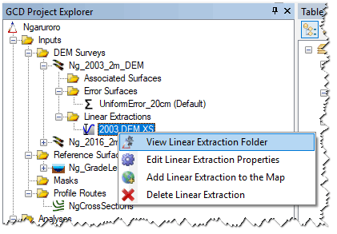
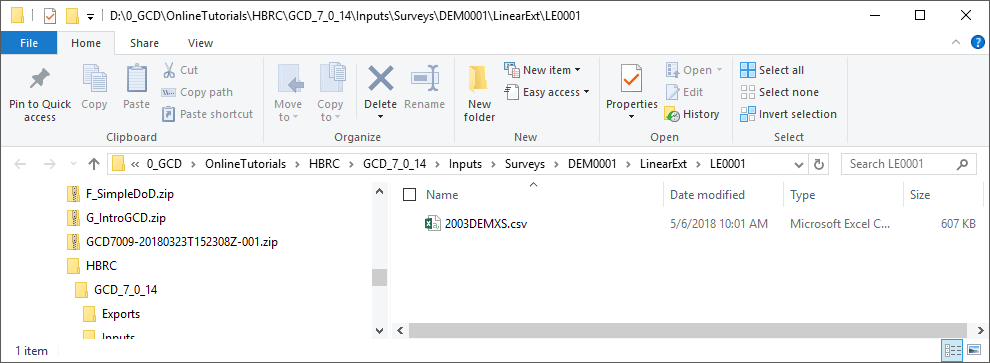
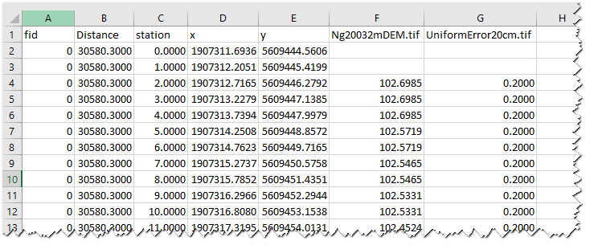

The **Calculate Linear Extraction from Profile Route** tool allows you to select a profile route from your [Profile Routes LIbrary]({{ site.baseurl }}/Help/Commands/gcd-project-explorer/Inputs/ProfileRoutes/), and extract DEM values and error surface values off of that route at a specified sample spacing.  The results are extracted to a CSV file, and can be exported into a database for visualization and interpretation  in the [Cross Section Viewer](http://xsviewer.northarrowresearch.com/).

The command window looks like:

### Video
This short video shows you how to run the **Calculate Linear Extraction from Profile Route** command:

<iframe width="560" height="315" src="https://www.youtube.com/embed/hFANAvOfc0k?rel=0" frameborder="0" allow="autoplay; encrypted-media" allowfullscreen></iframe>

### Prerequisites

You do need to have a [Linear Profile Route]({{ site.baseurl }}/Help/Commands/gcd-project-explorer/Inputs/ProfileRoutes/) in your Profile Routes library to perform an extraction.

------

## Working with the Results

If you want to view the results, right click on your linear extraction of interest, and click on **View Linear Extraction Folder**. This brings up the output folder in windows explorer (for the example in the video it is below):

### Using CSV file in Excel

You can open the `*.csv` file in Excel (note you may need to open it from Excel instead of just double clicking), and you will see a simple spreadsheet of the result of the extractions:

The fields are as follows:

|Field:                          | Description:|
|------------------------------- | --------- |
|`fid` | The FID for the feature route. Note that if multiple routes (e.g. cross sections) are in the linear profile, they each get a unique FID identifier    |
|`Distance` | The linear distance (streamwise) between cross sections (if applicable) to facilitate   |
|`station` | The distance along an individual feature route (note this increments by the chosen sample distance) |
|`x`     | The X coordinate  |
|`y`  | The Y coordinate |
|`Surface Name` | The elevation value at that station along the profile route from the DEM Surface|
|`Error Surface Name`| The value +/- of elevation error from the chosen error surface|

You can manually plot these profiles using the `station` field for your horizontal axis and the `Surface` and `Error Surface` fields for your vertical in R or Excel or your favorite graphing program. You can also export them to the  [Cross Section Viewer](http://xsviewer.northarrowresearch.com/).

This wandering video shows how to stumble through manually plotting up one of the 38 cross sections extracted in the above example all to make one figure:

<iframe width="560" height="315" src="https://www.youtube.com/embed/gBCQyn5I-mc?rel=0" frameborder="0" allow="autoplay; encrypted-media" allowfullscreen></iframe>

That alone should highlight the value of extracting these to a database and leveraging the  [Cross Section Viewer](http://xsviewer.northarrowresearch.com/).

------

	<a class="hollow button" href="{{ site.baseurl }}/Help"><i class="fa fa-chevron-circle-left"></i>  Back to GCD Help </a>  
	<a class="hollow button" href="{{ site.baseurl }}/">  Back to GCD Home </a>  

