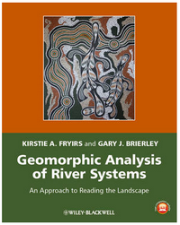

During the semester, we will cover the following GCD topics in fluvial geomorphology during our extended Monday afternoon sessions. Use the Page Contents navigation to find your topic.

As we cover topics, I will post and add slides below for your reference.

## Week 1
### Introduction & Setup

We covered some very basic background, and made sure we had [GCD properly installed](/Download/install).

import GoogleSlides from "@site/docs/src/components/GoogleSlides";

<GoogleSlides src="https://docs.google.com/presentation/d/e/2PACX-1vRtePz767JoiprO5s7Y-Y62nNq19ZtBfYuTmHpcBXnBeiesobpXS4VlwJQuL8G4nbYRoGagzqmUnY8p/embed?start=false&loop=false&delayms=3000" title="Introduction & Setup Slides" />

### Related Resources

- [**CONCEPT REFERENCE**: DEM of Difference (DoD)](/Concepts/dod)

-----

## Change Detection Applications

To motivate the interest in change detection, it is helpful to review a variety of applications (this is a very fluvially biased sample... sorry).

<GoogleSlides src="https://docs.google.com/presentation/d/e/2PACX-1vRclLYWDizQsMj-96AFMFE3FQVmbsNyD5W0IrwXLMO49VKwyNoVWLJAThJ4p2kHHdTEaQfeMFHAfwXK/embed?start=false&loop=false&delayms=3000" title="Change Detection Applications Slides" />

-----

## Traditional Geomorphic Change Detection

As to 'dive right in', and get your hands dirty with GCD, we did a quick demo of basic change detection techniques in ArcGIS with Raster Calculator, then did the same thing in GCD.

<GoogleSlides src="https://docs.google.com/presentation/d/e/2PACX-1vQ2Q60S_nR7e6KDSPpAMtlFu9VF3gbFKiYXA9Sfbpj1A3-XFj0lnoNGGvYMPuBrbN7AkVo_VJDtFFD3/embed?start=false&loop=false&delayms=3000" title="Traditional Geomorphic Change Detection Slides" />

### Related Resources

- [**TUTORIAL** Simple Change Detection in Raster Calculator vs. GCD](/Tutorials/ChangeDetection/GCD_Simple-DoD)

----

## Week 2

### High Resolution Repeat Topography to Support Change Detection

Backing up, to do geomorphic change detection requires high quality, high resolution repeat topography. We need to review how you get that.

<GoogleSlides src="https://docs.google.com/presentation/d/e/2PACX-1vQGSNQ3pGAiI1yxzS3_BdZZEIIK30jhtQquuOXTHX6HfIp-Z-ySqAFm_iruHXJ-alMu51sQEuJFwJq-/embed?start=false&loop=false&delayms=3000" title="High Resolution Repeat Topography Slides" />

### Related Resources

- [**TUTORIAL** Building DEMs from Topographic Survey Data](/Tutorials/Building_DEMs/building-dems)

<GoogleSlides src="https://docs.google.com/presentation/d/e/2PACX-1vTso96X4e_DmjjslEcJKNDsQ5cG9qcrZebShuekKqG8eJTORaFzSTQ6ZHVFDzJaupbslVCF1hCfje7d/embed?start=false&loop=false&delayms=3000" title="Building DEMs from Topographic Survey Data Slides" />

#### Background Reading on Change Detection & High Resolution Topography

- [**READING ASSIGNMENT**: Canvas Prep Reading Assignment](https://usu.instructure.com/courses/532404/assignments/2616300)

To do geomorphic change detection, one needs to have repeat topographic survey. There are many ways to acquire topographic data and this paper by Bangen et al. (2014) reviews some of the most common methods to acquire topography for wadeable streams. Please skim Bangen et al. (2014) to get an appreciation of common ways to survey topography and what are their limitations.

- Bangen SG, Wheaton JM and Bouwes N. 2014. [A methodological intercomparison of topographic survey techniques for characterizing wadeable streams and rivers](https://www.researchgate.net/publication/260043955_A_methodological_intercomparison_of_topographic_survey_techniques_for_characterizing_wadeable_streams_and_rivers)  Geomorphology. DOI: [10.1016/j.geomorph.2013.10.010](http://dx.doi.org/10.1016/j.geomorph.2013.10.010)

High resolution topography (HRT) has become increasingly common from a variety of platforms. This review by Passalacqua et al. (2015) discusses some of the most common challenges associated with producing and analyzing HRT to do meaningful change detection (among other analyses). Please skim to get an appreciation of the diversity of HRT applications, but focus on the sections that talk about change detection applications.

- Passalacqua P, Belmont P, Staley D, Simley J, Arrowsmith JR, Bodee C, Crosby C, DeLongg S, Glenn N, Kelly S, Lague D, Sangireddy H, Schaffrath K, Tarboton D, Wasklewicz T, Wheaton J. 2015. [Analyzing high resolution topography for advancing the understanding of mass and energy transfer through landscapes: A review](https://www.researchgate.net/publication/277477904_Analyzing_high_resolution_topography_for_advancing_the_understanding_of_mass_and_energy_transfer_through_landscapes_A_review). Earth Science Reviews. 148. pp. 174-193. DOI: [10.1016/j.earscirev.2015.05.012](http://dx.doi.org/10.1016/j.earscirev.2015.05.012).

-----

## Week 4

### Managing Raster Data for GCD

Unfortunately, simple raster based change detection requires doing a really good job of preparing and managing your raster data. We review some concepts and best practices to avoid the common pitfalls and make that simple subtraction problem work.

<GoogleSlides src="https://docs.google.com/presentation/d/e/2PACX-1vRsx-80zgEMSGKnJAgy1sZ0kQJ8QpxzhzAUE3fXIMI8TzzBrOEEwcU-wrQuOuSKBCysSI2rKEfgcs2m/embed?start=false&loop=false&delayms=3000" title="Managing Raster Data for GCD Slides" />

### Related Resources

- [**TUTORIAL**: Essential Best Practices to Support Change Detection](/Tutorials/Building_DEMs/Building_DEMs/bestpractices)
- [**CONCEPT REFERENCE**: Data Preparation - Best Practices](/Concepts/data-preparation---best-practices/)

----

## Thresholding

<GoogleSlides src="https://docs.google.com/presentation/d/e/2PACX-1vR54tDap2YGjboBidC98K9vvWtyZOjWFWZt7H2RY9ObR0xZJ2CxuV3hZPhbpgD_suc1UwNKRMn6J6Is/embed?start=false&loop=false&delayms=3000" title="Thresholding Slides" />

### Related Resources
- [**TUTORIAL**: Traditional Thresholding in Change Detection](/Tutorials/Building_DEMs/ChangeDetection/DoD-thresholding)

-----

## Week ? Soon

### Error Modelling

<GoogleSlides src="https://docs.google.com/presentation/d/e/2PACX-1vTicgovBn4WPFYjbSR9Vkc45-mqERhksEK5z9X8pKA-iFXBFH5UxEn72eQm33LzR4nAckyyEwi1ZiC-/embed?start=false&loop=false&delayms=3000" title="Error Modelling Slides" />
-----

## Week(s) After Spring Break
### Morphological Approach

<GoogleSlides src="https://docs.google.com/presentation/d/e/2PACX-1vT0mY9M9tFLL0VdQU3P1WRJ4VTJtax-TwvMkhjWALwT5uCSkotja36OgC0EAIcmkZDyNWNtHB9ROG4D/embed?start=false&loop=false&delayms=3000" title="Morphological Approach Slides" />

### Related Resources
- [**TUTORIAL** Morphological Approach](/Tutorials/GeomorphicInterpretation/morphological-approach)

This is based on the reading of Vericat et al. (2017):
- Vericat D, Wheaton JM and Brasington J. 2017. [Revisiting the Morphological Approach](https://www.researchgate.net/publication/316997409_5_Revisiting_the_Morphological_Approach_Opportunities_and_Challenges_with_Repeat_High-Resolution_Topography), Gravel-Bed Rivers. John Wiley & Sons, Ltd, pp. 121-158. DOI: [10.1002/9781118971437.ch5](http://dx.doi.org/10.1002/9781118971437.ch5). (see Damia's talk from [GBR here](https://www.youtube.com/watch?v=JPuxqrXStNM))
- [**READING ASSIGNMENT**: Canvas Prep Reading Assignment](https://usu.instructure.com/courses/532404/assignments/2616298)

## Budget Segregation
<GoogleSlides src="https://docs.google.com/presentation/d/e/2PACX-1vQ730SFqqmUorMxH1JU5qjquiuZh3zJ8yYCn6AjDhayBASIcQuOmyS7N5ByqoEJIf_lEOwMjYtQhj39/embed?start=false&loop=false&delayms=3000" title="Budget Segregation Slides" />

### Related Resources
- [**TUTORIAL** - Basic Budget Segregation](/Tutorials/GeomorphicInterpretation/simple-budget-segregation)
- [**TUTORIAL** - Morphdynamic Signatures from Budget Segregation](/Tutorials/GeomorphicInterpretation/morphodynamic-signatures-from-budget-segeregation)

This is based on the reading of Wheaton et al. (2013):
- Wheaton JM, Brasington J, Darby SE, Sear DA, Vericat D., and Kasprak A. 2013. [Morphodynamic signatures of braiding mechanisms as expressed through change in sediment storage in a gravel-bed river](https://www.researchgate.net/publication/242653748_Morphodynamic_signatures_of_braiding_mechanisms_as_expressed_through_change_in_sediment_storage_in_a_gravel-bed_river). Journal of Geophysical Research - Earth Surface. DOI: [10.1002/jgrf.20060](http://dx.doi.org/10.1002/jgrf.20060).
- [**READING ASSIGNMENT**: Canvas Prep Reading Assignment](https://usu.instructure.com/courses/532404/assignments/2616294)

 
-----

## Week of March 25
### Reading the Riverscape

- [Field trip handout](https://s3-us-west-2.amazonaws.com/etalweb.joewheaton.org/Courses/WATS4950/2019/Week9_WATS_4950_FluvialTaxonomy_FieldTrip_2019.pdf)

Our field trip is based on the Fryirs and Brierely (2013) textbook for reading the landscape, the fluvial taxonomy framework of Wheaton et al. (2015), which build off of [River Styles Framework](http://riverstyles.com), and the Fryirs et al. (2015) elaboration of confinement:

- Fryirs, K.A. and Brierley, G.J., 2013. [Geomorphic Analysis of River Systems: An Approach to Reading the Landscape](https://onlinelibrary.wiley.com/doi/book/10.1002/9781118305454), First Edition. Blackwell Publishing Ltd., Chichester, U.K., 345 pp
- Wheaton JM, Fryirs K, Brierley G, Bangen S, Bouwes N, and O’Brien G. [Geomorphic Mapping and Taxonomy of Fluvial Landforms](https://www.researchgate.net/publication/281321324_Geomorphic_Mapping_and_Taxonomy_of_Fluvial_Landforms). 2015. Geomorphology. 248: 273-295. DOI: [10.1016/j.geomorph.2015.07.010](http://dx.doi.org/10.1016/j.geomorph.2015.07.010)
- Fryirs K, Wheaton JM, and Brierley G. 2015.  [An approach for measuring confinement and assessing the influence of valley setting on river forms and processes](https://www.researchgate.net/publication/287108944_An_approach_for_measuring_confinement_and_assessing_the_influence_of_valley_setting_on_river_forms_and_processes). Earth Surface Processes & Landforms. DOI: [10.1002/esp.3893](http://dx.doi.org/10.1002/esp.3893)

- [**READING ASSIGNMENT**: Canvas Prep Reading Assignment](https://usu.instructure.com/courses/532404/assignments/2652920)

------

import { ToolsWrapper } from "@site/docs/src/components/ToolsWrapper/ToolsWrapper";

<ToolsWrapper
  cards={[
	{
	  toolUrl: "/Workshops/2019/wats5150/",
	  title: "Back to Course Home"
	},
	{
	  toolUrl: "/Workshops/",
	  title: "Back to Workshops"
	}
  ]}
/>